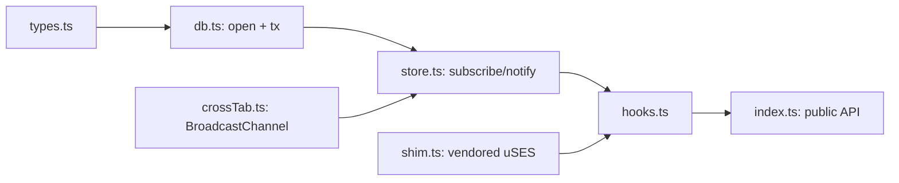

# react-idb-hooks

> Reactive IndexedDB hooks for React. Zero runtime dependencies. Works on React 16.8 - 19.

[](https://www.npmjs.com/package/react-idb-hooks)
[](#bundle-size)
[](./LICENSE)

**[Live demo →](https://rully-saputra15.github.io/react-idb-hooks/)** · open it in two browser tabs to see the cross-tab sync.

```sh
npm install react-idb-hooks
```

```tsx
const { data } = useIDBQuery(appDb, (db) => db.getAll("todos"), ["todos"]);
const { mutate } = useIDBMutation(appDb, "todos");
```

That's it. No provider. No atom registry. No class to subclass.

---

## Why this library

| | `react-idb-hooks` | [`dexie-react-hooks`](https://www.npmjs.com/package/dexie-react-hooks) | [`use-indexeddb`](https://www.npmjs.com/package/use-indexeddb) | [`idb`](https://www.npmjs.com/package/idb) (raw) |
|---|---|---|---|---|
| Bundle (gzip) | **2.4 KB** | ~65 KB (with Dexie) | ~3 KB | ~3 KB |
| Runtime deps | **0** | Dexie | 0 | 0 |
| Reactive React hooks | **yes** | yes (`useLiveQuery`) | partial (no live data) | no (you build it) |
| Cross-tab sync built in | **yes** (`BroadcastChannel`) | manual | no | no |
| Schema-typed reads & writes | **yes** | yes (Dexie ORM) | partial | minimal |
| Migrations API | **yes** | yes | partial | manual |
| React 16.8 - 19 | **yes** | yes | partial | n/a |
| SSR-safe (Next, Remix) | **yes** | with care | with care | with care |
| Last meaningful release | active | active | 2022 | active |

### What you get over the alternatives

1. **Smallest reactive option.** Dexie React Hooks is the only other library with live queries today; it pulls in ~65 KB. We do live queries in 2.4 KB by leaning on the React 18+ `useSyncExternalStore` (vendored shim for 16/17, no extra dep).
2. **Cross-tab is a feature, not a recipe.** Open two tabs, mutate in one, the other re-renders. No `BroadcastChannel` boilerplate, no `storage`-event hacks.
3. **Type-safe but not heavy.** Your schema is a single `interface`. `db.get("todos", id)` infers the value, the key, and the index names. No code generation, no runtime declarations.
4. **No magic.** Three hooks, function-based query, explicit dep list. The whole library is seven small files - you can read it top-to-bottom in 15 minutes. Easier to maintain, easier to audit.
5. **Concurrent-mode safe.** Native `useSyncExternalStore` on React 18 / 19, vendored fallback on 16 / 17. Strict-Mode double-mount tested.

### When *not* to use this

- You need a full ORM with bulk methods, joins across tables, and a `where(...).between(...)`-style query language. Use **Dexie**.
- You need a thin promise wrapper over raw IDB and you'll build reactivity yourself. Use **`idb`**.
- You only ever need a single key/value blob. Use **`idb-keyval`** or `localStorage`.

---

## Live demo

The [live demo](https://rully-saputra15.github.io/react-idb-hooks/) is the same code as [`examples/todos/`](./examples/todos). Source files worth a look:

- [`examples/todos/src/db.ts`](./examples/todos/src/db.ts) — schema + migration
- [`examples/todos/src/App.tsx`](./examples/todos/src/App.tsx) — every public hook in ~80 LOC

Run it locally:

```sh
git clone https://github.com/your-org/react-idb-hooks.git
cd react-idb-hooks && npm install
cd examples/todos && npm install && npm run dev
```

The Pages site is built and deployed automatically by [`.github/workflows/deploy-pages.yml`](./.github/workflows/deploy-pages.yml) on every push to `main`.

> **First-time setup.** In your fork, go to **Settings → Pages** and set **Source** to **GitHub Actions**. Then update two strings: replace `your-org` in this README with your GitHub org/username, and update `BASE_PATH` in the workflow file if your repo is not named `react-idb-hooks`.

---

## How to use

### 1 — Define your database

`defineIDB` opens (and migrates) one IndexedDB database. Call it once at module scope; subsequent calls with the same `(name, version)` return the same instance, so it's safe to import everywhere.

```ts
// src/db.ts
import { defineIDB } from "react-idb-hooks";

interface AppSchema {
  todos: {
    value: { id: string; title: string; done: boolean };
    key: string;
    indexes: { byDone: 0 | 1 };
  };
}

export const appDb = defineIDB<AppSchema>({
  name: "my-app",
  version: 1,
  upgrade({ db, oldVersion }) {
    if (oldVersion < 1) {
      const todos = db.createObjectStore("todos", { keyPath: "id" });
      todos.createIndex("byDone", "done");
    }
  },
});
```

> **Why a separate `interface`?** It is your single source of truth for types. The library reads the generic to infer everything: store names, keys, value shapes, index names. `upgrade` runs once per `version` bump - that is where you create stores and indexes at runtime.

### 2 — Read with `useIDBQuery`

```tsx
import { useIDBQuery } from "react-idb-hooks";
import { appDb } from "./db";

function TodoList() {
  const { data, status, error } = useIDBQuery(
    appDb,
    (db) => db.getAll("todos"),     // any async fn over the typed db
    ["todos"],                      // re-run when these stores change
  );

  if (status === "loading") return <p>Loading...</p>;
  if (status === "error")   return <p>{error!.message}</p>;
  return <ul>{data!.map((t) => <li key={t.id}>{t.title}</li>)}</ul>;
}
```

> **About the third argument.** `["todos"]` says "this query depends on the `todos` store". When any other component (or any other tab) mutates `todos`, this hook re-runs the function and re-renders. That is the entire reactivity model. We chose explicit deps over Proxy-based auto-tracking because they are visible in code review and impossible to misuse.

Inside the function you can call:

```ts
db.get("todos", id)            // by primary key
db.getAll("todos")             // every record
db.getAll("todos", range, 50)  // with range + limit
db.byIndex("todos", "byDone", 1)
db.byIndexAll("todos", "byDone", 1)
db.count("todos")
db.getAllKeys("todos")
```

### 3 — Write with `useIDBMutation`

```tsx
import { useIDBMutation } from "react-idb-hooks";

function AddTodo() {
  const { mutate, status, error } = useIDBMutation(appDb, "todos");

  return (
    <button
      disabled={status === "pending"}
      onClick={() =>
        mutate({
          type: "put",
          value: { id: crypto.randomUUID(), title: "New", done: false },
        })
      }
    >
      Add
    </button>
  );
}
```

`mutate` resolves **after** the IDB transaction commits and after the local + cross-tab invalidations have fired. Status transitions: `idle → pending → success | error`. The promise also rejects on error - use whichever fits your code.

The four operations:

```ts
mutate({ type: "put",    value: todo })             // upsert
mutate({ type: "add",    value: todo })             // insert (rejects on duplicate key)
mutate({ type: "delete", key: id })
mutate({ type: "clear" })
```

### 4 — Watch the connection with `useIDB`

```tsx
import { useIDB } from "react-idb-hooks";

function StatusDot() {
  const { status, error } = useIDB(appDb);
  // "loading" | "ready" | "error" | "unsupported"
  return <Dot color={status === "ready" ? "green" : "amber"} />;
}
```

`unsupported` means there is no `indexedDB` in this environment — server render, React Native, Firefox private mode in some configurations.

---

## Errors

Every recoverable IDB error is mapped to a typed class. `instanceof` works.

```ts
import {
  IDBVersionError,         // schema version conflict
  IDBBlockedError,          // another tab is holding an old version open
  IDBQuotaExceededError,    // out of disk
  IDBUnsupportedError,      // no indexedDB available
} from "react-idb-hooks";

try {
  await mutation.mutate({ type: "put", value });
} catch (err) {
  if (err instanceof IDBQuotaExceededError) {
    /* prune old data, ask the user to clear cache, etc. */
  }
}
```

---

## Caveats worth knowing

- **SSR.** `defineIDB` is lazy; it never opens at import time. During an SSR render `useIDB` reports `"loading"` and `useIDBQuery` reports `data: undefined`. Always gate your UI on `status === "success"` or render a skeleton, otherwise you'll get hydration mismatches. In Next.js App Router, mark client files with `"use client"` and never call `defineIDB` from a server component.
- **Safari / iOS.** Sometimes refuses to open IDB in private mode and may evict storage under pressure. Surfaced as `IDBUnsupportedError` and `IDBQuotaExceededError` respectively — handle them.
- **Firefox private browsing.** IDB is fully disabled. Hooks return `status: "unsupported"`.
- **React Native.** No `indexedDB`. Hooks report `"unsupported"`. Don't import the library on RN-only paths.
- **React 16 / 17 concurrent tearing.** Best-effort. Same vendored shim Facebook ships in `use-sync-external-store/shim`. Legacy roots have weaker guarantees than React 18+ concurrent roots.

---

## Bundle size

Measured with `npm run size` (esbuild minify + gzip):

| Build | Minified | Gzipped |
|---|---|---|
| Core (every public hook) | 6.1 KB | **2.4 KB** |

The `useSyncExternalStore` shim (~30 LOC) is vendored, so we avoid the `use-sync-external-store` dependency. React itself is a peer.

---

## Architecture (for the curious)

Seven source files. Strict separation of concerns - any two files share at most one concept.



- `db.ts` is the **only** file that imports `indexedDB`.
- `hooks.ts` is the **only** file that imports React.
- `store.ts` knows nothing about React or IDB.
- `crossTab.ts` knows nothing about React, IDB, or the cache.

---

## Contributing

```sh
npm install
npm test            # 22 vitest tests, ~2 s
npm run test:types  # tsc on test-d/, type-level assertions
npm run build       # tsup -> dist/ (ESM + CJS + .d.ts/.d.cts)
npm run size        # gzip budget guard (5 KB)
```

CI runs the full Node 18 / 20 / 22 × React 16 / 17 / 18 / 19 matrix on every PR. See [`.github/workflows/ci.yml`](./.github/workflows/ci.yml).

---

## License

MIT. Portions of [`src/shim.ts`](./src/shim.ts) adapted from [React's `use-sync-external-store`](https://github.com/facebook/react/tree/main/packages/use-sync-external-store), also MIT.
